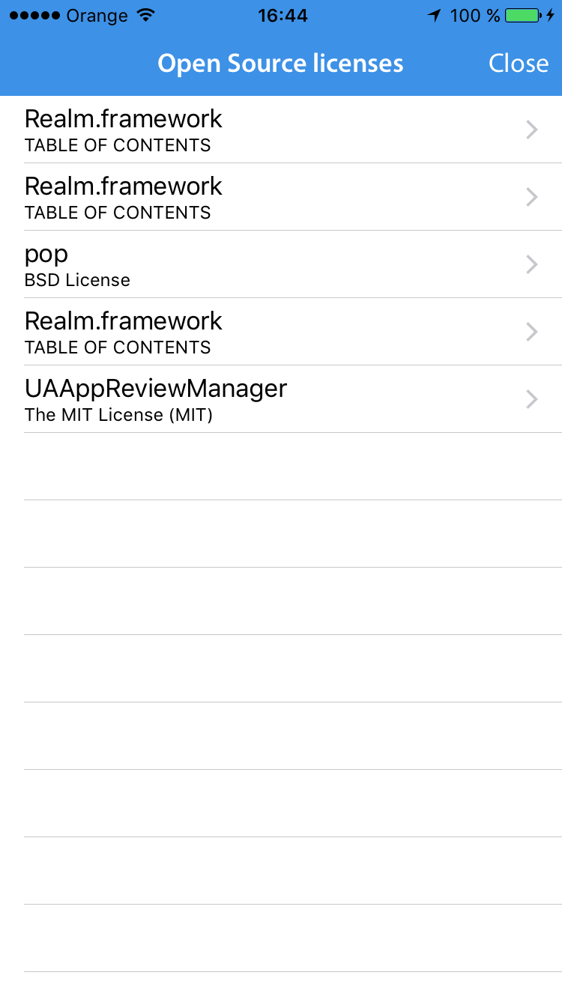
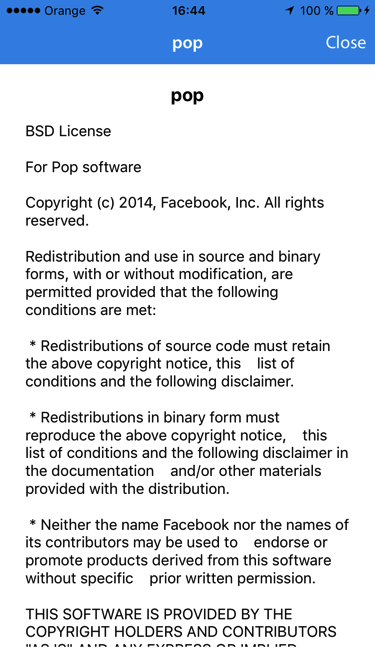

# CreditsKit

## A simple way to list third-party licenses in your iOS apps.

To use this library you first have to create a **.plist** with all the third-party libraries and licenses.

You can use the **CreditsKit.py** python script available in this repository to create the **.plist**

This python script recursively searches for 'LICENSE.*' files and put them into a friendly plist. 

### CraditsKit.py python script usage

```
./CreditsKit.py -s inputPath/ -o outputPath/FILENAME.plist
```

In case you choose to build the **.plist** manually, the content must be something like:

```
<?xml version="1.0" encoding="UTF-8"?>
<!DOCTYPE plist PUBLIC "-//Apple//DTD PLIST 1.0//EN" "http://www.apple.com/DTDs/PropertyList-1.0.dtd">
<plist version="1.0">
<array>
	<dict>
		<key>Text</key>
		<string>Here goes the license text. or any other text to show as the description
		<key>Title</key>
		<string>The library name</string>
	</dict>
	<dict>
		...
	</dict>	
</array>
</plist>
```

### Usage

- Add the **.plist** to your XCode project.

- Use this code:

```objc
CreditsKit* credit = [[CreditsKit alloc] initWithPListFile:@"FILENAME_without_extension"];
[credit setTitle:@"Just a title for the list"];
    
UINavigationController *nav = [[UINavigationController alloc] initWithRootViewController:credit];
nav.navigationBar.barTintColor = kSummaryColor;
nav.navigationBar.translucent = NO;
[self presentViewController:nav animated:YES completion:nil];
```

### Screenshots:





## Author

Fewlaps, core@fewlaps.com

## License

CreditsKit is available under the MIT license. See the LICENSE file for more info.
